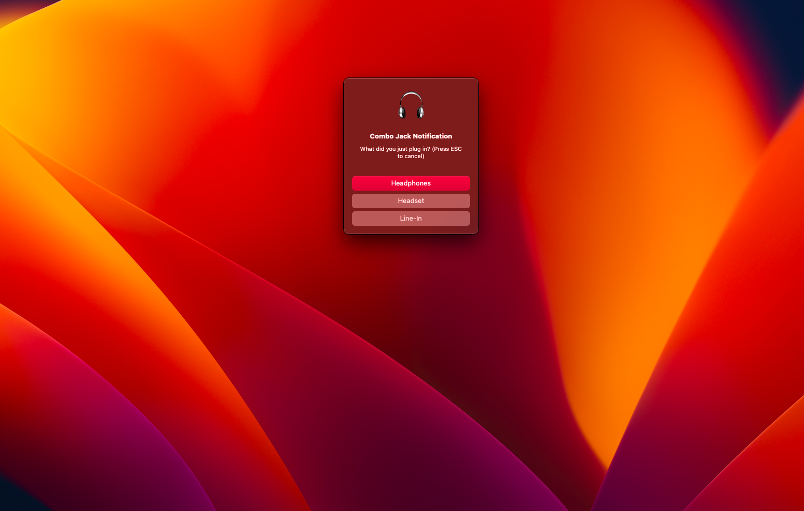

# EFI for Dell Inspiron 15 5567 using OpenCore

This repository contains the EFI ( Updated to OpenCore  0.9.0 ) folder for a successful hackintosh installation of macOS Big Sur or macOS Monterey and the ability to update to macOS Ventura (updated successfully) on a Dell Inspiron 15 5567 laptop with an Intel 7th generation i7 processor.

___

## Notes

Updated successfully to OpenCore [v0.9.2](https://github.com/acidanthera/OpenCorePkg/releases/tag/0.9.2) 

___
## Screenshot


___

## Laptop Specifications

- **Laptop Model**: Dell Inspiron 15R 5567

- **Processor**: Intel Core i7-7500U 2.50 GHz Processor (4M Cache, up to 3.50 GHz)

- **Memory**: 8GB, 2400MHz, DDR4, up to 16GB (additional memory sold separately)

- **Display**: 15.6-inch HD (1920 x 1080) LED-Backlit Display

- **Video Cardy**:
  - iGPU: Intel HD Graphics 620
  - dGPU: AMD Radeon(TM) R7 M445 Graphics 2G GDDR5

- **Audio Codec**: ALC3246 Analog (ALC256)

- **SATA Ports**: 2 SATA Ports, the second by removing the Tray load DVD Drive

- **Ports**: 1 HDMI v1.4a, 2x USB 3.0, 1x USB 2.0, Ethernet

___

## Installation

1. Download the latest version of OpenCore from the official website (<https://github.com/acidanthera/OpenCorePkg>).
1. Create a bootable USB drive using OpenCore and Use EFI-OC-for-KabyLake-PreInstall in this repository to make sure that macOS installation succeeded by renaming it to EFI and paste to USB EFI partition
1. By default, macOS will setup freshly formatted drives with 200MB. then by using <a href="https://github.com/corpnewt/MountEFI">MountEFI</a> mount that partition and paste EFI-for-booting folder and rename it to EFI


## Working Components

- HDMI
- Battery readouts (Not tested, I removed my laptop battery )
- Headphone audio output and input (wired and Bluetooth headphones) [How it work](#fix-headphone-jack--combojack)
- Keyboard and Trackpad (with gestures)
- Intel Bluetooth (Intel(R) Dual Band Wireless-AC 3165) [How it work](#bluetooth)
- built-in Intel Wifi (Intel(R) Dual Band Wireless-AC 3165) [How it work](#wifi)
- WiFi: tp-link TL-WN725N USB Adapter (Optional)
- USB ports
- Webcam

## Not Working

- dGPU -> AMD Radeon(TM) R7 M445 Graphics 2G GDDR5

## Bluetooth

⚠️ **If You Will Use The EFI For macOS Big Sur** do the next steps:

- Download [OCAuxiliaryTools](https://github.com/ic005k/OCAuxiliaryTools)
- open config.plist with OCAuxiliaryTools
- Go to kernel 
- For IntelBluetoothInjector.kext make it true

⚠️ **If Updating from Big Sur to Monterey or a higher version** do the next step:

- Based on [OpenIntelWireless Website of IntelBluetoothFirmware.kext ](https://openintelwireless.github.io/IntelBluetoothFirmware/FAQ.html#what-additional-steps-should-i-do-to-make-bluetooth-work-on-macos-monterey-and-newer) IntelBluetoothInjector.kext under Kernal->Add make it false or remove it.

⚠️ working well with macOS Ventura
### screenshot of WiFi


## Wifi
Now I added itlwm.kext [v2.2.0](https://github.com/OpenIntelWireless/itlwm/releases/tag/v2.2.0) and its true under Kernal->Add and download HeliPort app as WiFi control panel from [here](https://github.com/OpenIntelWireless/HeliPort/releases) and working at the same time with Bluetooth without any problem

⚠️ **BUT** NEVER use both itlwm.kext and AirportItlwm.kext at the same time.

### screenshot of WiFi


⚠️ If BT and WiFi didn't work with you on macOS Ventura after the first time installation, Try install BigSur or Monterey then update to Ventura

## Fix Headphone Jack / ComboJack

This is for ALC3246 Analog (ALC256) from (https://github.com/hackintosh-stuff/ComboJack)

1. put ComboJack_Installer/VerbStub.kext in EFI/OC/kexts/
1. Run ComboJack_Installer/install.sh in terminal (just drag and drop install.sh in terminal)

    ```
    ./ComboJack-master/ComboJack_Installer/install.sh 
    ```

1. reboot your laptop

When you attach a headphone there will be a popup asking about headphone type. and earphone and mic work fine

⚠️ working well with macOS Ventura

### screenshot



## Credits

- The OpenCore team (https://github.com/acidanthera/OpenCorePkg)
- The OpenCore installation guide (https://dortania.github.io/OpenCore-Install-Guide/)
- The hackintosh community (https://www.tonymacx86.com/)
- ComboJack (https://github.com/hackintosh-stuff/ComboJack)
